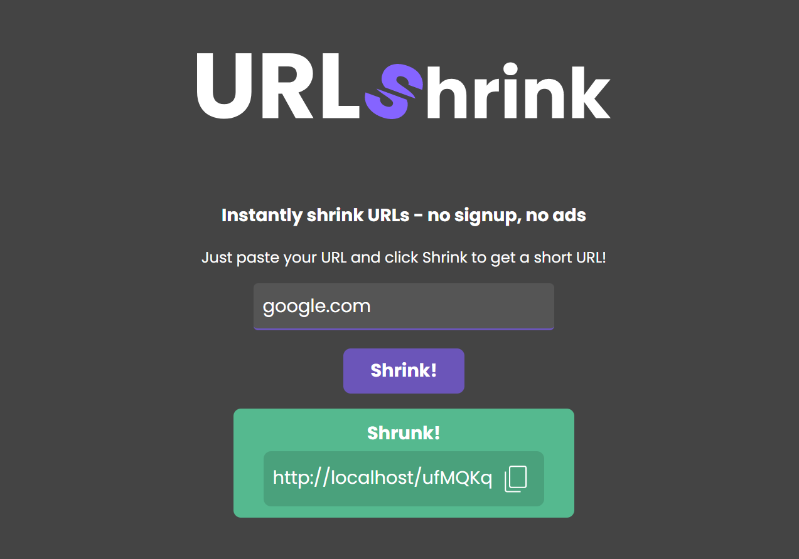

URLshrink is a fast URL shortener written in TypeScript, using Express and mongoDB.

# Install
* Install the dependencies: `npm install`
* Install [mongoDB](https://www.mongodb.com/)
* Adjust the configuration in `config.ts`, specifically `host` and `mongoDbUrl`
* Start it! Run `ts-node app.ts`

# Screenshot

